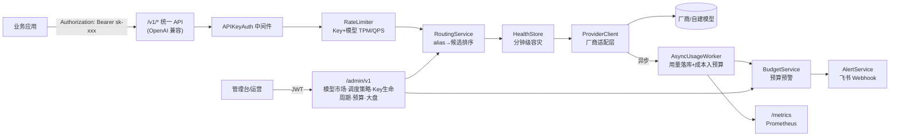

# llm-gateway

企业级大模型网关（Go + Gin + Redis + PostgreSQL）实现：
模型纳管/市场、OpenAI 兼容统一入口、跨厂商模型调度与分钟级容灾、Key+模型双维度
TPM/QPS 精准限流、"预算申请→调用监控→预算预警→模型调度→费用查看"成本治理闭环，
以及分钟级可观测与告警。

## 架构



代码分层（`internal/`）：

```
api/         gin handler：gateway(OpenAI兼容) + admin(JWT) + middleware + dto
service/     业务逻辑：模型市场、路由调度、Key生命周期、预算、成本、告警、异步落库
domain/      核心实体 + repository/adapter 接口（端口）
adapter/     端口实现：postgres仓储、redis限流/熔断、厂商适配器、webhook通知器
pkg/         零依赖工具：logger/response/idgen/tokencount/metrics/jwtauth
config/      viper 配置
server/      组合根：装配所有依赖并注册路由
```

## 快速开始

```bash
cp configs/config.yaml.example configs/config.yaml   # 按需修改
make dev-up                                          # 启动本地 Postgres + Redis
make run                                             # 启动网关 (:8080)，启动时自动执行数据库迁移
```

Docker 部署（镜像内含控制台）：

```bash
cd deployments/docker && cp .env.example .env && docker compose up -d --build   # 单机
cd deployments/cluster && cp .env.example .env && docker compose up -d --build  # 集群：Nginx + 1 master + N slave
```

单容器、Compose 单机、单机多节点 / 多主机集群、滚动升级与排障详见 [docs/deployment.md](docs/deployment.md)。

不接入任何真实厂商也能跑通全链路：把 Provider 的 `base_url` 设为 `mock://xxx`
即可路由到内置的 `internal/adapter/provider/mock` 适配器（无网络调用，用于本地开发/
演示/测试）。`scripts/smoke_test.sh` 用这种方式跑通了开号 Key、配置路由、调用网关、
触发限流、查看大盘的完整闭环：

```bash
./scripts/smoke_test.sh
```

## API

### 网关业务 API（OpenAI 兼容，`Authorization: Bearer sk-xxx`）

| Method | Path | 说明 |
|---|---|---|
| POST | `/v1/chat/completions` | 统一对话补全入口 |
| POST | `/v1/completions` | 兼容旧版单 prompt 接口 |
| POST | `/v1/embeddings` | 向量化 |
| GET  | `/v1/models` | 列出已上架且可用的模型 |

错误统一为 OpenAI 风格：`{"error":{"message","type","code","param"}}`；
429=限流，402=预算超限，503=无健康候选，502=上游错误。

### 管理台 API（`/admin/v1`，`Authorization: Bearer <jwt>`，先 `POST /admin/v1/auth/login`）

| 能力 | 端点 |
|---|---|
| 模型纳管/市场 | `providers` `models` CRUD；`POST /models/:id/try`（模型体验） |
| 调度策略 | `routing-policies` CRUD（alias → 候选模型，priority/cost_first/round_robin） |
| Key 生命周期 | `POST /keys`（申请）→ `PUT /keys/:id/approve`（分发，secret 仅返回一次）→ `PUT /keys/:id/blacklist` |
| 预算 | `POST /budgets`（同一 Key 同时只能有一个待审批 / 生效中的预算）；`GET /budgets/summary`；`GET /budgets/:id/consumption` |
| 大盘/告警 | `GET /dashboard/usage`、`/dashboard/cost`（按 key/model/provider + 日汇总）；`GET /alerts` |
| 账号 | `GET /auth/me`、`PUT /auth/password` |
| 多租户 | `departments` CRUD（超级管理员）；`users` CRUD + `PUT /users/:id/password` |
| Key 搜索 / 白名单 | `GET /keys/search?q=&status=&category=&page=`；`PUT /keys/:id/ip-whitelist`；`PUT /keys/:id/models` |
| 个人编码 Key | `POST /keys`（`category=personal`，`for_self`）；`GET /keys/mine`；`POST /keys/:id/claim`；`POST /keys/:id/rotate` |
| 厂商 / 供应商 | `vendors` CRUD；`POST /vendors/:id/suppliers`、`PUT/DELETE /vendor-suppliers/:id`；`providers`（供应商）含 `supplier_type` |
| 安全与合规 | `GET/PUT /security/settings`；`security/filter-rules` CRUD；`POST /security/filter-test`；`GET /request-logs`、`/request-logs/:id` |
| 视频生成 | `POST /playground/video` → `GET /playground/video/:task?model_id=`（轮询）→ `/content`（需厂商鉴权时代理下载） |

所有管理接口按登录账号的部门自动过滤；超级管理员可加 `?department_id=` 查看单个部门。

**分页约定（所有列表接口）**：带 `page`（从 1 开始）/ `page_size`（1–200，默认 20）时返回
`{"items": [...], "total": N, "page": P, "page_size": S}`；不带分页参数时仍返回完整数组（兼容下拉框等旧调用）。
各列表同时支持服务端筛选：通用关键字 `q`，以及 `status`、`level`、`type`、`action`、`approval_status`、`role`、
`category`、`key_id` 等。审计日志、告警、预算、应用、调用日志、请求记录与 Key 在数据库层分页（`LIMIT/OFFSET` + `COUNT`），
厂商、部门、用户、公告、调度策略、过滤规则等配置类列表在服务端内存分页。预算页的统计卡片来自 `GET /budgets/summary`。

## 关键机制

- **限流**：`internal/adapter/ratelimit/redis` 用 Lua 脚本做 QPS（1 秒固定窗口）+ TPM
  预占/结算（请求前按「输入估算 + max_tokens」预占，收到厂商真实 usage 后回补/多扣）。三个维度独立
  生效：Key（所有模型合计）→ 部门（部门内所有 Key 合计）→ 模型（所有 Key 合计，饱和时切换下一个候选）。
- **调度与容灾**：`internal/service/routing.go` 按策略（priority/cost_first/round_robin）
  排序候选；`internal/adapter/circuitbreaker/redis` 维护滚动错误率，超阈值的候选被标记
  不健康并冷却 60s，实现分钟级故障切换。
- **成本与预算**：`internal/service/cost.go` 按模型定价核算成本；`AsyncUsageWorker` 异步
  落用量记录并把成本累加进预算，超过阈值/额度触发 `AlertService`（落库 + Webhook，默认
  飞书自定义机器人格式）。
- **可观测性**：Prometheus 指标见 `internal/pkg/metrics`（`/metrics`）；zap 结构化请求日志
  含 request_id/key/model/tokens/cost/latency/来源 IP，`log.prompt_max_chars` 控制 prompt
  是否记录及截断长度（合规考量）。

## 控制台功能（`web/`）

Vue 3 + TypeScript + Vite + Element Plus + ECharts，对接 `/admin/v1`。菜单与截图对齐，详见
[docs/architecture.md](docs/architecture.md)：

| 分组 | 页面 |
|---|---|
| 概览 | 总览大盘 |
| 模型 | 模型市场（卡片 + 厂商/类型/上下文/标签筛选、详情、接入说明、加入我的模型）· 我的模型 · **模型调度**（架构图 + 调度策略 + 路由模拟） |
| 模型体验 | 文本生成（多轮对话）· 图片理解 · 图片生成 · **视频生成**（异步任务、文生/图生视频、多任务并行对比） |
| 监控与容量 | **模型监控**（调用/性能监控）· **Key 监控**（RPM/TPM/RT、Token/调用趋势、失败率与 RT 排行）· 容量管理 · 告警中心 · 调用日志 |
| 模型成本 | 成本大盘（含周报推送）· 均价赛马（含模型切换建议、厂商折扣）· 预算管理（分级审批） |
| API Key | **我的 Key**（领取密钥、用量、编码工具接入指引）· Key 申请（应用 Key / 个人编码 Key）· Key 管理（分类、审批分发、配额、可用模型、IP 白名单、重置、拉黑）· 黑名单 |
| 安全与合规 | **提示词过滤**（总开关、拦截/脱敏/记录规则、规则测试）· **请求记录**（提示词与响应内容留存、检索、对话视图） |
| 平台管理 | 部门管理 · 用户管理 · 应用管理 · 厂商管理 · 供应商管理 · 公告管理 · 审计日志 · **数据导入导出** |
| 开发者 | API 文档（接口说明、多语言示例、在线调试） |

菜单与按钮按角色显示，服务端同样强制校验权限。

```bash
make web-install   # 首次
make web-dev       # http://localhost:5173 ，/admin 与 /v1 代理到 :8080（GATEWAY_URL 可改）
make web-build     # 产物在 web/dist
```

## 两类 API Key

| | 应用 Key | 个人编码 Key |
|---|---|---|
| 用途 | 线上业务系统调用 | 员工日常编码（Cursor、Cline、Continue、Codex CLI、Claude Code 等） |
| 归属 | 应用 → 部门；成本按应用核算 | 员工本人 + 部门；每位员工限一个（按邮箱） |
| 申请 | 部门管理员 / 超级管理员 | 任何人可为本人申请（含只读成员）；管理员可代无账号员工申请 |
| 密钥 | 审批人在审批时看到一次 | 持有人在「我的 Key」**本人领取**（审批人看不到）；管理员重置会作废旧密钥并要求重新领取 |
| 配额 | 按申请；正式 Key 需预算，支持 7 天试用 | 默认 TPM 200,000 / QPS 5，同时受部门配额约束 |
| 模型 | 默认不限，可设「可用模型」 | 默认仅开放编码模型（可调整）；名单外调用返回 `403 model_not_allowed` |

编码工具通常以 `stream: true` 调用、并以数组形式传 `content`：网关兼容这两点——`stream: true` 时返回 OpenAI SSE
（`chat.completion.chunk` + `[DONE]`，完整回复就绪后分块推送），`content` 数组中的文本段会被合并。
**暂不支持** function / tool calling 透传，依赖原生工具调用的 Agent 需使用基于文本协议的工具（如 Cline、Continue、Aider）。

## 厂商与供应商

- **厂商**（`vendors`）是模型的研发方，如 DeepSeek、阿里通义、OpenAI、Anthropic；**供应商**（`providers`）是调用渠道：
  厂商官方 API、云平台（百炼、方舟、千帆、ModelArts、Bedrock、Azure…）、代理商或自建集群，带 Base URL、凭证与折扣。
- 一个厂商可由多家供应商提供（`vendor_suppliers`）：同名模型在各供应商分别上架、分别定价与限流。厂商管理页维护每个厂商的
  供应商清单、启停、优先级与权重；供应商管理页按类型（官方直连 / 云平台 / 代理商 / 自建）管理渠道。
- **模型调度的供应商维度**：请求可写 `供应商编码/模型`（固定渠道）或 `厂商编码/模型`（限定厂商）。没有命中调度策略时，按厂商的
  「供应商选择方式」路由——成本优先（折后价）、供应商优先级、供应商权重；调度策略也可选用「供应商优先级 / 供应商权重」排序其目标。
  对某厂商停用的供应商不再承接该厂商的任何流量（策略目标同样跳过），故障时在供应商间自动切换。
- 演示数据：DeepSeek 由 KubeAI 自建、华为云、阿里云、百度、官方与 OpenRouter 六家供应，按优先级路由；Anthropic 由 Bedrock / 官方 /
  OpenRouter 按 70/20/10 权重分流；OpenAI 的 OpenRouter 渠道处于停用（合规评估中）。

## 批量导入导出

- 控制台「平台管理 · 数据导入导出」汇总全部可导入导出的数据，各列表页右上角也有「导入 / 导出」按钮（导出按当前筛选条件）。
- **可导入**（按模板）：部门、用户、应用、厂商、供应商、模型、API Key（批量提交待审批申请，含个人编码 Key）、提示词过滤规则；
  **仅导出**：预算、审计日志、告警、调用日志、请求记录（元数据，不含完整请求体）。
- 模板为 Excel：数据 Sheet（必填列标 *、枚举列带下拉）+ 填写说明 Sheet；也支持 CSV（UTF-8 或 Excel 默认的 GBK）。导出的文件可直接修改后再导入。
- 导入分两步：**校验**（逐行给出新增 / 更新 / 跳过 / 错误，含行号与列名）→ **确认提交**。有错误时默认整批不导入，可勾选「跳过错误行」；
  已存在记录可选择跳过或更新。每行都经由与控制台表单相同的服务写入，部门隔离、角色限制、密码策略、Key 每人一个等规则同样生效。
- 限制：单文件 ≤ 5 MB、≤ 5000 行；导出 ≤ 50,000 行（超出截断并提示）。CSV 导出会转义 `= + - @` 开头的单元格，防止公式注入。
- 每次导出与提交的导入都会记录到 `data_transfers`（操作人、文件、各类计数、错误明细），在导入导出页查看。
- API：`GET /admin/v1/transfer/entities`、`GET /transfer/:entity/template?format=xlsx|csv`、`GET /transfer/:entity/export?format=&<筛选参数>`、
  `POST /transfer/:entity/import`（multipart：`file`、`mode=validate|commit`、`on_conflict=skip|update`、`skip_invalid`）、`GET /transfer/jobs`。

## 安全与合规

- **Key IP 白名单**：每个 Key 可配置 IPv4/IPv6 地址或 CIDR 网段（最多 100 条），名单外的调用返回
  `403 ip_not_allowed` 并产生安全告警。客户端 IP 默认取 TCP 对端地址，**不信任** `X-Forwarded-For`，
  部署在负载均衡后需在 `server.trusted_proxies` 中配置代理网段，否则调用方可伪造来源 IP。
- **提示词过滤**（默认关闭，需在「提示词过滤」页由超级管理员手动开启）：关键词或 RE2 正则规则，命中后
  *拦截*（`400 content_blocked`，不转发厂商、不计费）、*脱敏*（替换后再转发，厂商看不到原文）或*仅记录*；
  可选同时检测模型输出（命中拦截规则时返回 `finish_reason: content_filter`）。规则分平台级（超级管理员）
  与部门级（部门管理员，仅对本部门 Key 生效），修改 10 秒内生效，命中次数实时统计。
- **请求记录**：`/v1` 每次调用的提示词、响应、命中规则、Token 与耗时由中间件捕获，经缓冲队列**异步批量**写入
  `request_logs`，不增加调用延迟；队列满时丢弃并计入 `gateway_request_log_dropped_total`。可在「记录设置」
  中关闭记录、只记元数据、按脱敏规则隐藏敏感信息后再保存、设置单条上限与保留天数（过期自动清理）。
  记录与调用日志共用 `X-Request-Id`；只读成员无权查看内容。
- **模型市场厂商很多时**：常用厂商（按模型数排序）以标签直接展示，其余收进「更多厂商」弹层（搜索、分组、多选），
  已选中的长尾厂商自动出现在标签栏；支持按厂商分组浏览、排序与分页。
- **Key 下拉框**：统一使用服务端搜索的 `KeySelect`（`GET /admin/v1/keys/search`），按名称 / 负责人 / 前缀 /
  应用 / `#ID` 检索，每次只取 30 条，Key 数量再多也不卡顿。

## 演示数据

```bash
make seed           # 数据库为空时写入演示数据（会先自动迁移到最新结构）
make seed-reset     # 清空网关表后重新生成（会重置 14 天流量的时间基准）
```

可直接调用网关的演示 Key（Mock 适配器，无需真实厂商凭证）：

| Key | 用途 |
|---|---|
| `sk-demo-a1-customer-service` | 客服机器人-生产；`gpt-4o` 被策略切换到豆包 Flash |
| `sk-demo-a3-aiops-manager` | 告警智能分析；`deepseek-r1` 命中 Key 专属策略（自建集群优先） |
| `sk-demo-a4-search-embedding` | 电商搜索 embedding |
| `sk-demo-a7-data-analysis` | 数据分析助手 |
| `sk-demo-p1-suntao-coding` | 孙涛的**个人编码 Key**（仅可调用编码模型，如 `claude-sonnet-4`、`deepseek-v3`、`qwen3-coder-plus`） |
| `sk-demo-p3-wangfang-coding` | 王芳的个人编码 Key（代外包员工申请，无控制台账号） |

管理台账号：首个超级管理员由 `configs/config.yaml` 的 `admin` 段创建；部门演示账号见下文「多租户」。

## 多租户（部门）与管理员

- **部门**是租户：拥有应用 → API Key → 预算、Key 级调度策略与流量。可设置**部门级 TPM/QPS 总配额**，网关对部门内所有 Key 合并限流；停用部门后其成员无法登录、其 Key 调用返回 403。
- **角色**：

  | 角色 | 权限 |
  |---|---|
  | 超级管理员 `super_admin` | 全平台：厂商、模型、部门、用户、公告、全局调度策略、CTO 级预算审批；可在顶栏切换「部门视角」 |
  | 部门管理员 `dept_admin` | 本部门：应用、Key 审批/拉黑/配额、Key 级调度策略、总监（D）级预算审批、本部门成员 |
  | 只读成员 `viewer` | 本部门只读：监控、成本、日志、模型体验、API 文档 |

- 所有列表、监控、成本、告警、日志接口都在服务端按部门过滤；角色/禁用状态每次请求实时从库读取，修改立即生效。
- 账号存储于 `admin_users`（bcrypt），登录 5 次失败锁定 15 分钟，密码至少 8 位且含字母与数字。首次启动时若没有超级管理员，用配置中的 `admin.username/password` 创建；之后该配置不再用于登录，请登录后修改密码。
- 限流三级独立生效：**Key 配额**（该 Key 所有模型合计）、**部门配额**（部门所有 Key 合计）、**模型容量**（所有 Key 合计；饱和时自动切换候选）。

演示账号（`make seed` 生成，密码 `Demo@12345`）：`cx_admin` / `cx_viewer`（客户体验部）、`infra_admin`、`ecom_admin`、`risk_admin`、`data_admin` / `data_viewer`。

## API 文档

- 控制台「开发者 · API 文档」：快速开始、鉴权、路由规则、限流与错误码、每个接口的参数/响应表、cURL/Python/Node.js/Go/Java 示例，以及**在线调试**（用你的 Key 直接调用网关，显示状态码、耗时与 `X-Request-Id`）。
- 机器可读规范：`GET /openapi.json`（OpenAPI 3.0，无需登录，`servers` 自动指向当前网关地址），可导入 Postman / Apifox 或生成 SDK。

## 压测（TPM / QPS）

独立工具在 [`loadtest/`](loadtest/README.md)：恒定 QPS、目标 TPM、阶梯加压、并发四种模式，输出延迟分位、429 分布与逐秒时间线，并可断言限流准确性（`-expect-qps` / `-expect-tpm`，失败退出码 3）。

```bash
make loadtest-qps     # Key 级 QPS 限流验证
make loadtest-tpm     # Key 级 TPM 限流验证（约 2 分钟）
make loadtest-ramp    # 阶梯加压探测容量
```

## 数据库迁移与健康检查

- 迁移文件（`migrations/`）已嵌入二进制。默认 `postgres.auto_migrate: true`：网关（以及 `cmd/seed`）启动时自动把空库或旧库升级到当前版本，
  多实例并发启动由 Postgres advisory lock 串行化，不会再出现 `relation "xxx" does not exist`。
  集群部署时只有 master 节点（`cluster.node_type`）执行迁移，slave 等待 schema 就绪后再对外服务。
- 关闭自动迁移时，启动会检查 schema 版本，**不匹配则直接拒绝启动**并给出修复提示，而不是带病运行。
- 手动管理：`make migrate-up` / `migrate-down` / `migrate-version`；脏状态用 `go run ./cmd/migrate force <版本>` 清除；可用 `-dir` 指定外部 SQL 目录。
- `GET /healthz` 仅表示进程存活；`GET /readyz` 检查 PostgreSQL、Redis 与 schema 版本，未就绪返回 503（控制台顶部状态徽标使用它）。
- 运行期若仍遇到表/列缺失，管理端返回 503 及修复提示、网关 `/v1` 返回 `schema_not_ready`；**详细 SQL 错误只写服务日志**，不再返回给客户端。
  API Key 鉴权遇到数据库故障也不再被误报成 `Invalid API key`。

## 测试

```bash
go test ./... -race
```

`internal/service/gateway_test.go` 用内存 fake 实现（不依赖真实 Postgres/Redis）驱动整条
网关管道：成功调用、故障切换、限流拒绝、未知别名。

## 生产化前需要替换的占位实现

- 管理台登录（`internal/api/admin/auth.go`）当前是单账号密码校验，生产环境应接入
  真实 IdP/SSO/RBAC。
- `internal/pkg/tokencount` 是近似估算器（非真实 BPE 分词），用于 TPM 预占；生产环境如
  需要精确计费，可替换为各厂商 tokenizer 或以厂商返回的真实 usage 为准（网关已在结算阶段
  这样做）。
